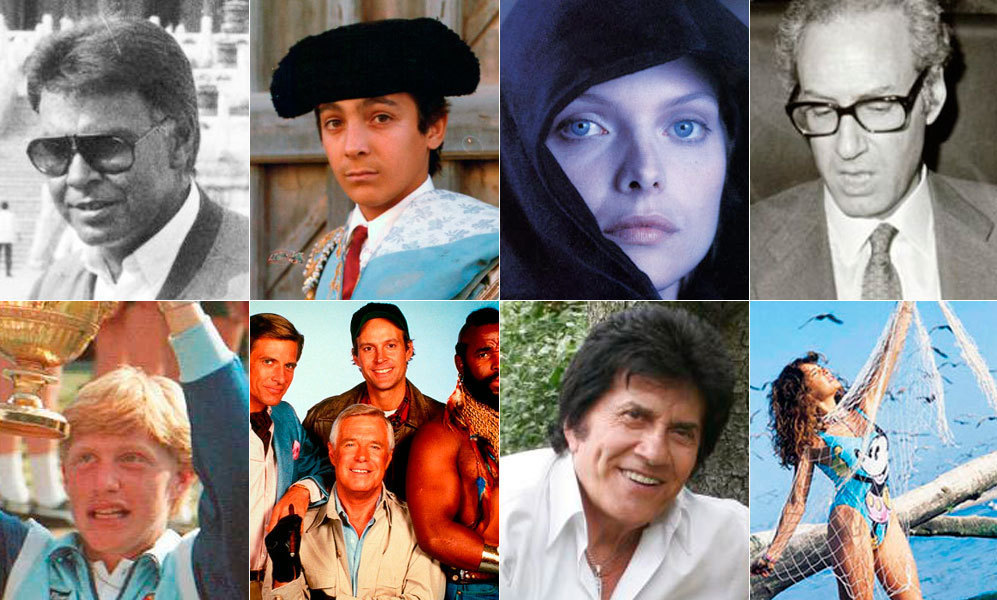

# Morning reflections and automatic writings {#morning}

## *Corona Times* in Berlin. 2020-03/04 

### Scarcity mindset, positive mirroring, and non-hypocritical veganism. (2020-03-30)
 
10.36
 
15min-power nap. 
 
Just to enter, just to learn how to go deep, and then, how to go up. How to access to that place where orthography faults don’t matter. That place where I can delve and let my brain work and my hands move. Because I don’t care, I don’t care about the one that reads, I don’t care either about the one that writes. 
 
I cannot go backward and let my fingers correct something that they wrote. I may do it later or may not. If I think this doesn’t work, if I let it be maybe, just maybe some useful information may appear on the page. It is all about surrender. Surrender and write whatever the fuck is going on. Nothing about going backward, just forwards, forwards, forwards. 
 
So, now, that you have the forwards movement, the next rule is not being able to stop. Just download the information directly into the page. And the information of today it is that it is time to routine. Routine because I want to upgrade to the next level routine because I just ordered the room and what I found was space, empty space. That is what I need. 
 
I had again to fix my own life first, to start fixing that of others. That is the problem. I hate when people become not only defensive but also attacking. One thing is trying to correct others' faults. Pointing at them and telling them how to do it better. But something I hate it when people go straight and directly for the attack. They are looking for my inconsistencies and they are pointing them out in a way that just looks for conflict, for bringing me down, for letting me know that I am not perfect, that I am not god, that I’m also human, that I sin, that I have flaws ad that I haven’t reach everything in my life. 
 
I was asking P. yesterday in WhatsApp whether saying someone “*What you see negative in me, you see it negative in yourself*” is an attack or not. It is clear that a **positive mirror** is saying “*Whatever you see good on me, you see good on yourself.*” “*Whatever you see good in me you have it inside yourself.*” But it takes time to realize that **whatever they see negative in you is negative things people have in themselves**. You may not say it, but just point it out at them. That is the simplicity. 
 
People may have a scarcity mindset and that is why they may think and say that 4 bananas for one day are not enough. That is really sad. Four bananas are a lot, enough for not only one day but for one week. People are too attached to their material resources, also to the immaterial ones. They think of their thoughts and ideas as something real, something that is already being manifested in reality. Look if I have an idea and you don’t like it, you don’t need to tell me that it won’t happen. Just take it as an idea, as a potential modification and manifestation of the atoms of this universe. It is not happening now, and neither you, now I, know if that will happen. That is what you need to learn and discover. Don’t deny an idea that hasn’t happened yet because you don’t know if it will ever happen. If it will ever happen. That is the magic of ideas. They are just potentialities of this universe. So, next time you are criticizing a creative idea, make it constructive, don’t do it in a destructive denial way. Be humble. 
 
If I defend veganism, and then I eat cheese, don’t try to criticize me, because I have done it. Keep on observing yourself. I only admit critics, and I only include them in my system when those critics came from people that are more aware and conscious than I am. From people that are more knowledgeable than I am. I f I don’t eat meat or cheese, and one day I eat it, look, respect my process. If you are still thinking in dualities, in either-or, in ones and zeros, you are still in a vibration that it may hinder you the comprehension of what I do. I’m not defending omnivores, and I will never do it. I will keep on defending veganism, and I am fully aware that this is one of the most ethical ways of surviving as human beings ^[Frugivore may be more ethical even.]. But the point here is that if you haven’t experienced my reality, don’t tell me my inconsistencies. 
 
I just point out to the moral flaws of your behavior, and my hypocrisy may be a moral flaw, but it is still a smaller one than your systematically murderous behavior each time you buy and consume food. Now you may argue that I believe that I have moral superiority. That I am claiming to be morally right, or that I am just setting up a moral hierarchy, where murder is worse than hypocrisy. Well, you are right. I am doing it. If you cannot see how murder is worse than hypocrisy, then you may be a hypocrite of your own feelings and emotions. Lying, or telling partial truths is part of human experience, of human communication. Not only human but also animal. However, murdering systematically and increasing the suffering of other livings beings is not too inherent in human realities, in human nature, in human existence. This is something you may want to interiorize in your belief system.
 
Therefore, you better start realizing the consequences of your acts and stop watching the inconsistencies of others. 
 
Jesus was quite clear and specific (supposedly) 
 
> Why do you see the speck that is in your brother’s eye, but do not notice the log that is in your own eye?
> 
>Matthew 7:3
 
I have been attacked since ever and I will still be, and that is part of the game, part of the process. Part of self-claiming myself as a prophet, as a guru, or as a messiah. People got crucified for claiming to be God’s son, and I got crucified for defending veganism and then eat 15 grams of cheese. 
 
Well, what can I do? If it bothers you so much. Don’t buy the cheese, and I will not eat it. And if it bothers you that I eat more veggies than you, stop eating meat and you may understand me. 
 
**Lesson: change your mindset. Abundance over scarcity.** 
 
10.51
 
Revision and correction. 
 
11.14
 
 
 
### Observe with perspective. Worries disappear when you zoom out. (2020-04-08)

Tegel Airport, Berlin, Germany – COVID times.^[If you like to see my face and hear me talking, click [here](https://photos.google.com/u/1/photo/AF1QipPbV_wHExFJ8xGO_19g338LBqHV0GT3Vm5OQylm).]

Many people may call me irresponsible, but I think that the most punishable act right now is to be so close of taking a plane considering the environmental situation of the planet. 

Psilocybin heals. It heals so much that it could have been difficult to believe my calm and tranquility concerning my own death or the death of the whole humankind. I don’t know. Today I was reading about octopus and the fact that their phylogenetic line with squid and cuttlefish separated around 370 million years ago. Not bad at all. We, humans, have been around 300.000 years as species, and our civilization dates from 12.000 years. Sometimes I find ridiculous the whole existential angst that we have developed out of our realization of being temporarily alive. Octopus only live 2 to 3 years; we live from 50 to 80 depending on how lucky you are when you are born. Many times, it is all about luck. 

I guess I lack empathy, and I have an excess of transcendental perspective. It is undeniable that we have done a huge mess over this planet. That we have asphalted forest and place concrete over everything we could. We have built massive structures to show ourselves how tall our Babel Towers could get. And still, we are just apes. [*F\*cking talking monkeys*]( https://carlitofluito.github.io/letters2019_20/ohm-namae.html), nothing else. Life is so compelling, that a bird just entered the terminal and the dozens of people waiting for the plane couldn’t avoid looking at the chirping animal, flying around, probably confused about the place that just entered, wondering where are the trees, the leaves, the grains, the branches, the green. 

Before taking the psilocybin, I couldn’t fully understand [David Cain’s](www.raptitude.com) comments like: 

>*Observe your surroundings and imagine how everything would have been like millions of years ago. *

or

> *Observe your surroundings and appreciate how pretty much anything of what you see would change if you would disappear right now from the earth. *

It is tough to acknowledge and appreciate these truths when you are a teenager, fighting for consolidating your identity. But it is a sing of maturity to appreciate the level of irrelevance that we all carry in our existence. We are nothing. We are nothing as individuals, and we are nothing as species. We are just another manifestation of life in this planet, in this universe. And with the passing of the years, all our marks, even those with the deepest scars and impact in the planet, like radioactive waste, all of them will be gone. That’s it. Nothing more. 

And I am incredibly tranquil writing this. I am incredibly chill. Like If I knew that these levels of truths, no matter how discomforting can be for some people are utterly undeniable. We have become too attach to life. We have grown distant from death. 

We are children, maybe teenagers, striving to have  a consolidate identity as species, that is why it is so difficult for us to acknowledge that nothing of what we are doing, or what we will ever do is inherently irrelevant. 

None of my words justify immoral behavior. None of my words justify the increasing of pain and suffering in living beings of this universe. Never get me wrong. Suffering and pain are something that living beings avoid and reject. Therefore, no matter how irrelevant we are, that is no excuse to cause harm or suffering in other forms of consciousness. 

In a similar way, none of my words justify despair or suicide. None of my words justify the act of willingly finish our own consciousness. No matter how irrelevant any of our actions is, our current form of consciousness is a gift that should be enjoyed and experience to the utmost (respecting the no-harm/no-suffering moral of before as much as possible). 

I am aware this is not high philosophy. Likely, if you have never subjectively experience what I am talking about you may be unable to embody and comprehend its meaning. Nevertheless, I try. I have the hope that some of my words can make people wake up a bit and realize their role in this whole game called life and the universe. We may just be a simulation running somewhere in a quantum computer of some sort. And that is okay. It doesn’t mean we cannot enjoy our current existence, and it doesn’t mean we should decrease the enjoyment of other existences. 

I guess that the smaller we feel about ourselves, the more we need to prove and validate who we are and what we do, and the more we need to find relevance and importance in our own actions. On the other hand, the bigger we feel and experience our consciousness, the more we can appreciate our role in the whole life performance. Individually, we are just tiny atoms in the whole history of the universe. The whole human species is just a drop in the ocean of life and evolution in planet earth. 

Let the waves wave and let the tides tide. Let the atoms merge and dissolve, let them structure and matter change. Let us try to maintain our existence, but let’s not get attached to it either. Let’s appreciate each of the moments of consciousness we have been gifted with and make the worries about non-existent realities disappear. 

Enjoy the journey, because there is nothing else than the journey. The whole universe will freeze out at some point, and existence has no more meaning than the one you create out of love in your own individual life. Love life and meaning will appear by its own. 

### Man-made life vs. Universe-made life (2020-04-09)

14.40

Bus from Madrid to Valladolid (Spain)

First day of pseudo quarantine. 

Yesterday, I was in Berlin, in Paris, and in Madrid. Three European capitals. All empty, from airport to airport. Actually, Berlin looks pretty normal; Paris was empty from the airplane; and Madrid empty from the streets. 

I am afraid of sneezing too loud. I am still with my thinking and my feelings of enjoyment and pleasure. Everything is empty, the planet is breathing. It is taking a break from humans. It is common sense for me. Maybe the next pandemic will not be so tolerant with us. Actually, we are the pandemic. Covid is just the antidote. It is the balance. 

Today, I did nothing. The friend that hosted me for one night in a tiny guest’s room at his place told me not to touch anything, not to go out, not to do much. I understand his concerns. I obeyed. Hydroalcoholic solution at the door and sleeping all morning because there was not much to do. I almost meditate but I used the smartphone in the morning. Too much dopamine. That was the mistake, as always. 

At my family house, my brother can manage my smartphone, so I can use more the mornings; and the days; and the nights. Smartphones are sucking people’s lives, and this is one of those clear situations. 

What can I say about the pandemic? Politics and discussions. Funerary cars, and the police not allowing people to travel to their homes because they already have an alternative. The mountain looks beautiful. Psilocybin still works. It is like being high for life. That is wonderful. Once every six months. 

All this post-apocalyptic panorama seems to me a very wonderful scenery. No humans. Animals taking over. I don’t think I am a psychopath; I just prefer to empathize with the weakest, with the most vulnerable. In this case, it is nature and not human. 

I dreamt with Zambia. I dreamt I was there already. Creating, working with kids, in a big industrial unit. I am traveling to save money; to have enough to carry on with my plan; to buy a land and say “*Ciao ciao*” to all this game called society. I realized I don’t want to play anymore to these rules. They are not for me. And that is okay. Although it seems that it is not either for most of us. 

Robots will end up taking over. And that is not life as we know it. It is a different type of life. A man-made life. But *man-made life* has consisted in destroying *universe-made life*. It is weird. It put us in perspective. How much we have changed all this.  

## *Corona Times* in Valladolid. 2020-04

### Grandad’s old war tales - Batallitas de abuelo Cebolleta. (2020-04-12)
 
06.40

Kids and machines will make us highly irrelevant. It is this simple. There is no other way around. 

I used to think I was young, but my right knee aches when I sleep in cold small places, like cars or floors. Tonight, I was sleeping on the carpet of the living room of my family house, and I couldn’t breathe properly. Maybe the dust of the carpet; maybe my respiratory system. In any case, ailments of old age.

Kids in the upcoming years will prove themselves infinitely more prepared and skilled than us, adults. What we can do will be of little use. Maybe teach them how we used to do things years ago; maybe just remember them that things used to be different in the past. After all, who of us likes to hear grandpa’s old war tales? 

We are in a historical moment where, being 27, anecdotes from my childhood may seem a First World War tale to 7 years old. Imagine being born today, in 2020. Seven years ago, 2013 (my third year of university in Barcelona) look to me just around the corner. But for a newborn kid like me, 7 years before my birth (1992) used to be 1985^[Thanks to [Wait But Why]( https://waitbutwhy.com/) for [the inspiration]( https://waitbutwhy.com/2020/01/its-2020-and-youre-in-the-future.html).].

Falling into topics, this is what 1985 seems to me today:

(\#fig:1985) I just recognized [*The A-Team*](https://en.wikipedia.org/wiki/The_A-Team), and I was doubting about former Spanish president [Felipe Gonzalez]( https://en.wikipedia.org/wiki/Felipe_Gonz%C3%A1lez).

Tonight, I was dreaming that kids were teaching me a lesson about how to do things, how to use devices, how to live in an environment that my brain hasn’t had time to adapt to. I likely felt similar to how my grandma feels when I explained her for the fourth time how to send a voice note on WhatsApp. 

On the other hand, my grandparents from my father's side cannot care less about technology. They wonder when they see my face on a screen and respond to what I say, no matter whether it is a video record or a video call. 

However, we awe together when we see my second niece, their great-granddaughter, using the smartphone as if it was second nature. Between great-granddaughter and great-grandparents, there are about 80 years of difference. Between my second niece and me, just 20. One fourth. This means I am getting older 4 times faster. Using my extremely faulty math, the difference between my grandparents and me is about 60 years. In just 15 years, one fourth, when I become 42, I will feel as outdated towards my second niece, as my grandparents feel with me now.

I can choose to be a wannabe updated “*WhatsApp grandma*” spamming the family with videos that no one will watch, or just accept the speed of development. I may try to speak to a device’s microphone that is not anymore in the palm of my hand when it is actually a network already merged with my brain and [working through my thoughts](https://waitbutwhy.com/2017/04/neuralink.html). 

I may be wrong, I may not. I guess I have read too much [Tim Urban]( https://www.ted.com/speakers/tim_urban). But the question is worthwhile:

>[*What does it feel like to stand here?*](https://waitbutwhy.com/2015/01/artificial-intelligence-revolution-1.html)

(\#fig:edge) If you read [*Wait but Why*](https://waitbutwhy.com/), it shouldn’t be difficult to follow my train of thought. If you don’t, you should. Start [here](https://en.wikipedia.org/wiki/Wait_But_Why).

Enjoy your day and live in the present. 

### Karmic cleansing (2020-04-17)

10.51

How do you see it, my friend?

How do you see it? Do you think that you can already start with your room, or not yet?

Do you think that there is a gallery and Alejandro's storehouse that are still to be done? Can you leave the kitchen perfect and before starting with and then everything will flow?

This is a karmic cleansing, which dad is not being grateful for, and he keeps thinking that I am making it selfishly, although I may do it selfishly as altruism is selfish, but it benefits everyone. 

David, the same. He stays in his short-term, thinking on what his perception is showing now and not realizing what it can become in just a few hours or days. They keep on focusing on the negative, in the chaos they perceive, instead of on the order that they could perceive if they look at the bathrooms, or if they look at the wardrobes of the gallery, or kitchen. They don't realize that the clothes are done. They don't realize that the food has been cooked all these days. Mother is able to see it a little more, but not completely. 

Anyways, what do you dream of?

Do you dream of the idea of sleeping in the bed, like C.? Do you dream of the idea of cleaning up yourself? That is the problem. You have to give the phone to your mother at night, you have to find ways to block your problems, you know what they are. You know that it makes your life you don’t want, and you don’t deserve. You just need to isolate away from what you know is bad for you. 

But at least, you have healed from the loneliness, from your friends. You know your friends and you know your plan and you know that your friends will join you when your plan starts to materialize. You have seen it already. You know it is not difficult and you know you have a strategy, a system. You know what to do to reach there. You will go to Bali I for a little bit to get to know some famous guys,

There, where you are already in the game, you know you are in this game where you are cleaning and ordering your house an that is what you have. No problem. This is your moment. Now, this is your place, this is what you have to do. 
 
 
Probably you have to switch your identity. You have to become a new person, and you don’t have a lot of time to do it. You are moving fast, and fast you to switch your identity. You need to develop and sustain routines. Saol told you, and he knew it perfectly that is your next step to become serious with your mission and with what you can do now. You don’t lose your chill anymore, at least yesterday you were able to show Cillo your limits and your limits are
 
Don’t threaten my life.

Don’t shout.

Don’t lie.

Don’t deny reality.

Don’t call me selfish or egoist.

I will be extremely clear about that. Clear and concise. 
 
He cannot say “*Don’t touch my balls*” as a limit because I will go through it. 

I am not A. and I am not a manipulative and destructive monster that just wants to destroy people. I want to make them grow and they are the ones that are suffering because of their stubbornness. It is not my problem. If they would let them be guided, they may discover how easy is to make everything going and moving, but they have a lot of barriers. Dad has a lot of barriers, but little by little they are being overcome. Well, hopefully, it will be gone soon 

Let’s see how it develops. For the moment, just keep on going. Maybe focus on your room, on yourself for a bit today. Organize Alejandro’s room and then move forwards and forward. That’s what I have to do. To keep on moving, Probably we’ll reach a moment when they will tell me “*Thank you*” and that they want to do it with me, but until that moment arrives it will be a bit of an uphill battle. 
 
You heard the lock of the door of the bath now that Cillo went inside. They don’t realize, but that is lack of trust and shyness, or whatever the name. They are ashamed of their own bodies and that’s a big problem, a problem that takes longer, and that little by little we are overcoming. I am not ashamed of my body and that is what allows me to be happier, to be able to move naked around, to fart, to burp naturally, to eat like a pig. Because maybe I am a pig. I am not ashamed of it. I am what I am, and that is it.

You can check if you feel the connection with something of what I write and then move forward, what can I say? I have worked for being in front of a computer for years. I have tons and tons of paper, or written words, that if I would like to write it down it would take me a lot. That is the next level, when I have a single objective and I am finishing things one by one, thanks to my routine, when I spend days and days working because I love my work, I love what I do, I love wiring and I love stretching and training day after day. That is my moment and my situation, to prepare my body, and to move forward with my writing. I want to show my evolution to the world, I want to prove that it is possible, that I have done that right now. “*I am still stuck*” means, I have progressed, I am moved forwards enough to be able to write and publish. That’s it. 
 
I generate too much, and for this moment, this is fine. 

It is already 15 minutes. 

### Money mindset (2020-04-26)

09.40
 
Today I am going to make money. Not because I need it, but because I can. Also, because I need it. This is a win-win relationship with the world. If I am happy, people around me are happy. If I build my goals, and I reach the places where I want to be, everyone will be winning. I will be raising the vibration of the planet, and that is meaningful, that is important. 
 
Spirituality is speed and deep psychology. Yesterday, in a brief, meditation/activation, I said goodbye to my previous sources of money, I said goodbye to my promoter, V., who gave me a scholarship of 2.000€ per month for doing a Ph.D. that I didn’t finish; and I said goodbye to R., my landlord, who saved me from spending that money in the rent of my flat. Now, I am at my parents' house, after two months of not receiving my salary, and after having spent part of my savings on the rent in Berlin. I am ready to work hard again. I have several books to read, several videos and websites to prepare and do, and several clients to catch. Money is out there, clients are out there, and I am the one that has to find them. I am intelligent enough to go not only for those that have some money but for those that have high amounts of money as well. I am ready to have high-paying clients, and I am going to find them. And they are going to find me. There is no problem or contradiction if at the same time I am making free, high-quality content for free to all those that cannot afford my sessions or my courses. I don’t need this or that. I have myself and I am going to do it. It is just a step by step process. I am on it, I am with it. 
 
And that’s it. I am flexible enough to not force myself to write during the whole morning, to not break the momentum and motivation with writing 30 minutes. Sometimes just half a page is enough to be clear on what I am going to do. 
 
Enjoy your day. 

### Tolerating lack of faith (2020-04-28)

**Paradoxes of tolerance.**

23.23^[This is a night reflection actually.]

Hope my words resonate with you. 
 
If you need a map to understand me, here it is:
 
1. If you are intolerant with other people, you first have to learn how to be tolerant with yourself. You can do this by practicing your acceptance. 
 
2. Once there, when you are tolerant of yourself and you have accepted who you are at this given moment, you can develop tolerance and acceptance for others. You can do this practicing compassion.^[Warning note: I just went peeing and realized that all this is an oversimplification, since my lovely psychopath made me grow by 1) tolerating things in myself, while 2) not tolerating certain things in others. Thus, one learns how to protect their own energy and stablish healthy limits with other people. But those are topics and nuances for another text.] 
 
3. Once there, when you are tolerant, acceptant, and compassionate with yourself and with others at this given moment, you can develop intolerance towards yourself. You can do this by practicing...^[This text is sparked by Regan Hillyer's [*"How what you tolerate creates your reality""*](https://www.forbes.com/sites/forbescoachescouncil/2017/01/17/how-what-you-tolerate-creates-your-reality/) and Alyse Parker's [*“We are not the highest version of ourselves which we can imagine. We are the lowest version of ourselves which we can accept. If you want to achieve your dreams you must turn them into irrefutable standards.”*](https://www.instagram.com/p/B35WEXGgQc9/?utm_source=ig_web_copy_link). Since I like to complicate things, I wrote my own realization.]
 
----
 
I have to tolerate more; at the same time, I tolerate less. I have to tolerate less negative emotions within myself. But I have to tolerate more negative emotions within others. 
 
I used to be unable to tolerate people. I used to be unable to tolerate negative emotions in others, specially when they were transmitting me those lower vibrations. Because I couldn't tolerate these negative emotions in myself, I couldn't tolerate them (emotions) on them (people) either. That is why I couldn't tolerate them (people) altogether. 
 
I have always been a quite intolerant person with other people. I couldn't stand incompetence, I couldn't stand mediocrity, I couldn't stand how people were doing things so wrong that I could do so right. It was because they were generating negative emotions and feelings within myself.

Same as when I was trying to explain something to someone and they were not understanding me. Those negative emotions on myself were what I wasn't able to tolerate, and that is what made me unable to tolerate them (people). My lack of tolerance to people was a projection of those negative feelings on myself. 
 
Nowadays, that phase is gone. I have recently gone through the stage of not caring about what others do. Of telling myself things like "*Fine, if they want to try something, they can. If they are doing something, good for them. I know I can do it better.*" However, maybe deep inside, I was still a bit frustrated with their mediocrity. Sometimes, I even told myself that I was happy when I was seeing others succeeding. Even though, I still knew that what they were doing, I could do it, and I could do it better. 
 
However, today, after this tolerating lesson, things are different. 
 
"**_We are not the best version of ourselves that we can imagine. We are the worst versions of ourselves that we can tolerate._**" A mixed quote of two wonderful souls, [Regan Hillyer](https://www.reganhillyer.com/) and [Alyse Parker](https://www.instagram.com/alyseparkerr/?hl=en). 
 
I, [Carlito Fluito](https://www.carlitofluitoideas.com/), which is a soul developed out of paradoxes, am simultaneously arriving and leaving at a new stage, a new interpretation of what tolerance and intolerance mean. 
 
I have always been intolerant. Wrongly intolerant. Wrongly **intolerant with myself**, which is indeed, wrongly tolerant with myself. Bear with me. 

I didn't tolerate myself. I was unsatisfied, it was never enough, I wanted to be above the rest. But at the same time, I was tolerating too many of my mistakes, and I was tolerating too much of my current situation.

Also, I have always been **intolerant with others.** I was being highly intolerant with those that hadn't reach my levels of intolerance towards themselves. Because I didn't want to be a mediocre person, my levels of intolerance pushed myself further and further. So, I grew. But my intolerance couldn't tolerate the levels of tolerance that others have towards themselves. I couldn't tolerate that others were so tolerant of themselves, and that is what made me so intolerant of them.
 
We are a reflection of what we see outside. There is no division between the inner world and the outer world. The intolerance I saw in others was the intolerance of myself. *The intolerance I had towards others' tolerance was my intolerance towards my own tolerance.*^[You may want to re-read the quote above.] 
 
I couldn't stand people that were mediocre because I couldn't stand my own mediocrity. 
 
I got frustrated and impatient when people don't understand what I say and do, because I got frustrated and impatient when I don't understand what people say and do.
 
Once, I started to be more flexible with other people’s beliefs and practices. Once, I started to be more tolerant with what those above me did and said, that I was not fully understanding of; I was becoming more tolerant with what those below me did and said, which I didn't fully understand, although I had been at their place not long ago. 
 
It is my lack of memory, and my lack of perspective what limits my views. 

Now, it is not frustrating, when people argue with me, or doubt about me. I don't have to care about that, I don't have to spend my energy on their doubts, I have to focus that energy on myself. Focus all the intolerance that I was sending to them, to myself, untill the moment that their doubts disappear, not because now they believe, but because now, they can see. They can see how my intolerance to my own being has materialized in all the things that once I said that I was going to get.  
 
I cannot tolerate anymore this version of myself that is intolerant. I cannot tolerate my intolerance to others. And this is the paradox: that through the intolerance, I can become tolerant. 
 
It is all about directions: inwards, outwards, inwards, outwards. 
 
At some point of the spiritual path, tolerance to the self appears again and reminds us that we have to be compassionate and acceptant, that we have to acknowledge who we are at a given moment, and we have to accept what people are at a given moment. We have to become more tolerant with ourselves and more tolerant of others.
 
But at another point of this spiritual path, we move beyond and stop being tolerant with ourselves, to keep on growing and move even further, further beyond. 

About these places where I am heading, I cannot talk about, because I haven't been there. Those places where I am heading are unknown to me. That is therefore the gift of ignorance, the infinite things yet to be discovered.^[This is my humble humbleness, that needs so much strenghtening. Another upcoming paradox... ]
 
Lots of love and tolerance to you all. 
  
Carlito Fluito

