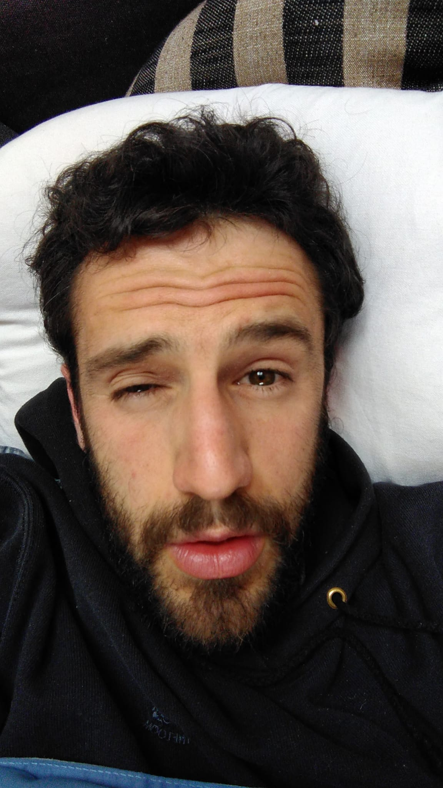

--- 
title: "Dreams and morning reflections (Automatic writings)"
author: "Carlos Alcala a.k.a. Carlito Fluito"
date: "2020-03-31"
site: bookdown::bookdown_site
documentclass: book
bibliography: [bibliography.bib]
biblio-style: apalike
link-citations: yes
github-repo: carlitofluito/dreams
description: "This is a compendium of the texts written straight after waking up, a collection of my dreams and morning reflections, using an automatic writing technique."
---

# Preamble {-#preamble}

Words come to our minds. Sometimes from a mess of thoughts and images that we struggle to process; sometimes from a void of unconscious mysteries that we barely comprehend. 

Automatic writing is an attempt of downloading this ethereal information in unprejudiced way. The goal is increasing one’s mind understanding. 

Some of my most-liked text were written in pseudo-trance, half-intentional ways. Readers seem to be keen of these VIP accesses to my psychological reality. Entry badges that allow the exploration of places where I might have never been, and I may never return. Radical honesty in its purest form. 

Enjoy the journey and understand as much as you can. 

Intuitively, 

C. F.

(\#fig:narciso)Good morning! :-)

## Bonus {-#bonus}

As an extra, I have added my [*Morning affirmations*][affirmations] and [*Routine*][routine], in case it serves as an inspiration for anyone.

At the moment, I am very happy to interact with my readers. I will write in the future more specifically and clearly my practices. Nowadays, they may be a bit difficult to understand if it is the first time you read something from me. I suggest you take a look to [my guides](https://www.carlitofluitoideas.com/unfinished-books/) with [*Life advice*](https://carlitofluito.github.io/life_advice/), the one for [*Thriving with COVID-19*](https://carlitofluito.github.io/thrive_covid/), or the one for [*Ph.D. Students*](https://carlitofluito.github.io/phd_guide/)^[*Life advice* is very similar than the one referred above. I suggest reading the other one if you are not a Ph.D. student.]. Therefore, if you have any comments, or questions about what is written, feel free of [email me](mailto: carlitofluito@gmail.com) or contact me, though [my website form](https://www.carlitofluitoideas.com/contact/). 

Best of lives!!! 
